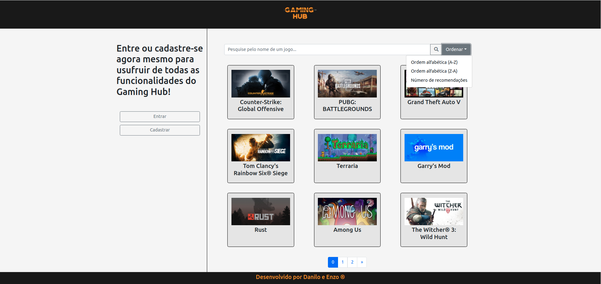
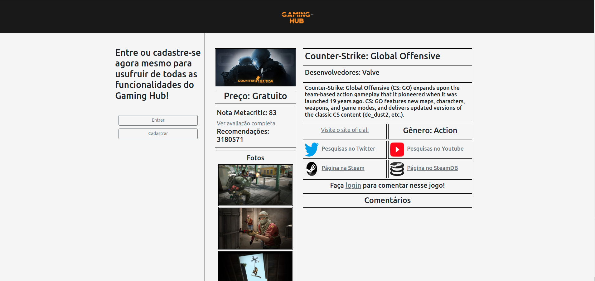
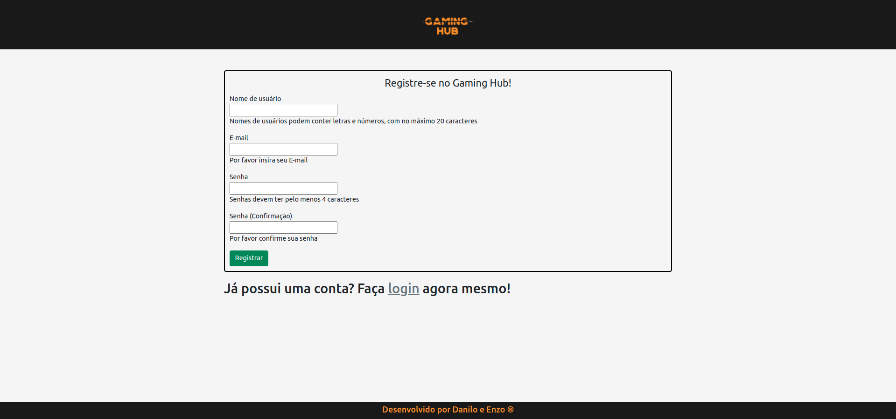
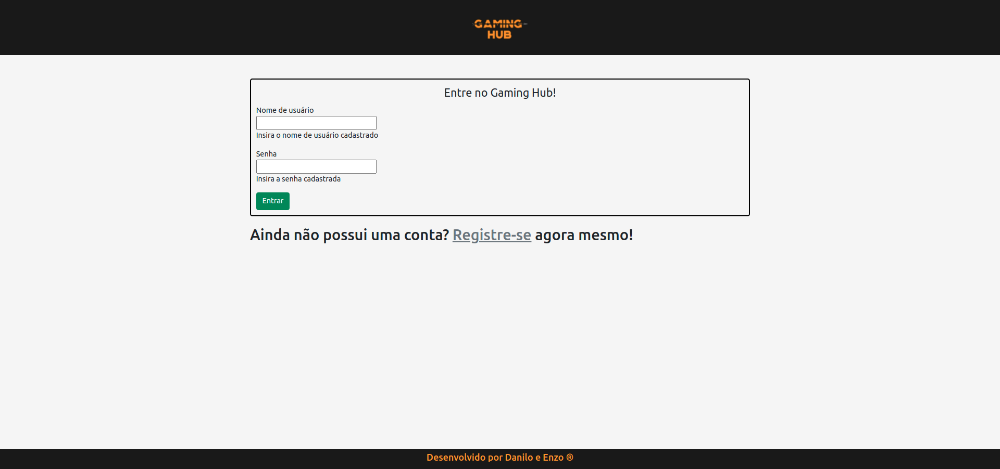
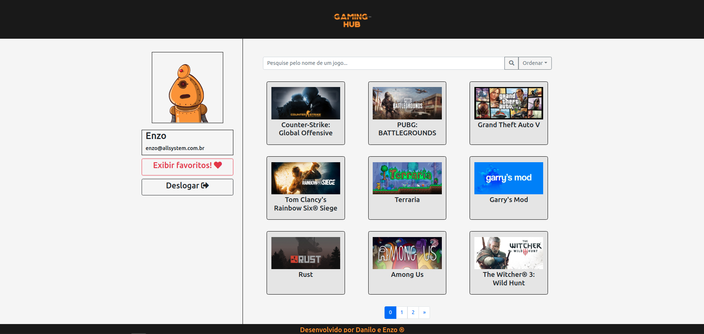
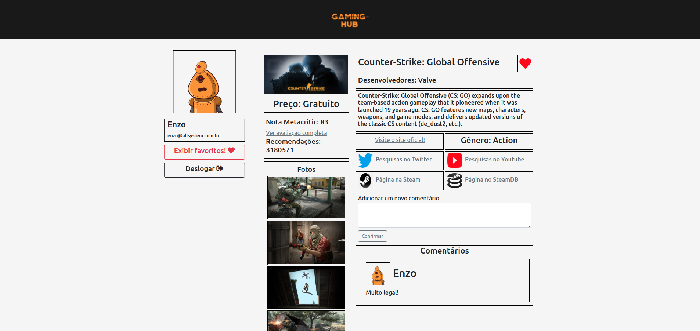

# Gaming Hub

## Proposta do projeto

O Gaming Hub surgiu com a intenção de facilitar a vida da comunidade gamer. Nele os usuários podem rapidamente obter informações cruciais, tais como preço, notas e opiniões sobre os jogos que estão no catálogo do site. Além disso, o Gaming Hub proporciona uma interação entre a comunidade a partir de uma aba de comentários, onde cada usuário pode revelar o que achou de um jogo.

Além disso, usuários podem favoritar os jogos que mais os agradam, o que permite uma filtragem específica, para ficar por dentro de tudo o que acontece com esses jogos.

O Gaming Hub utiliza uma API da plataforma Steam para obter os dados sobre os jogos. A API pode ser encontrada no seguinte link:

[API da Steam appdetails](https://store.steampowered.com/api/appdetails?appids=220)

## Como instalar?

O Gaming Hub é uma aplicação web contruída a partir de Java e dos frameworks Maven e Spring. Isso significa que para acessá-la, um usuário tem duas opções: 

1) Se o projeto tiver hospedado em um domínio público, basta entrar na URL disponibilizada. Nesse caso, hospedamos o projeto em um servidor gratuíto da [Heroku](https://dashboard.heroku.com), o qual pode ser encontrado em:

[Visitar o Gaming Hub!](https://gaming-hub-pi.herokuapp.com/GamingHub)

2) Caso o usuário deseje rodar o servidor localmente, é preciso que ele possua o [Java](https://www.java.com/pt-BR/) e [Maven](https://maven.apache.org/install.html) instalados em seu computador. Feito isso, basta clonar o projeto com:

`git clone https://github.com/enzocussuol/Gaming-Hub/`

E rodar tudo (na pasta raíz) com:

`mvn clean install`

O Gaming Hub estará disponível na url localhost:8080 (localmente).

## Exemplos de uso

O Gaming Hub pode ser utilizado tanto deslogado quanto logado. Como usuário deslogado, é possível pesquisar por jogos e realizar ordenações:

Além disso, usuários deslogados podem checar as informações dos jogos:

Para logar, basta criar uma conta clicando no botao Cadastrar:

Feito o cadastro, o Gaming Hub o redirecionará para página de login:

Agora, ao logar, as informações pessoais estarão à esquerda, assim como uma foto única gerada a partir do email pelo site (robohash)[https://robohash.org/]:

Finalmente, agora o usuário pode, na página de jogo, favoritar e comentar:

## Licença

O repositório utiliza a licença MIT. Ver `LICENSE` para mais informações.

## Informações sobre os autores

O projeto foi desenvolvido por Danilo Lima e Enzo Cussuol para a disciplina de Projeto Integrado 1, do curso de Ciência da Computação da Universidade Federal do Espírito Santo (UFES).

Email para contato:

Danilo: danilinhoerlerlima@gmail.com  
Enzo: enzo@allsystem.com.br
